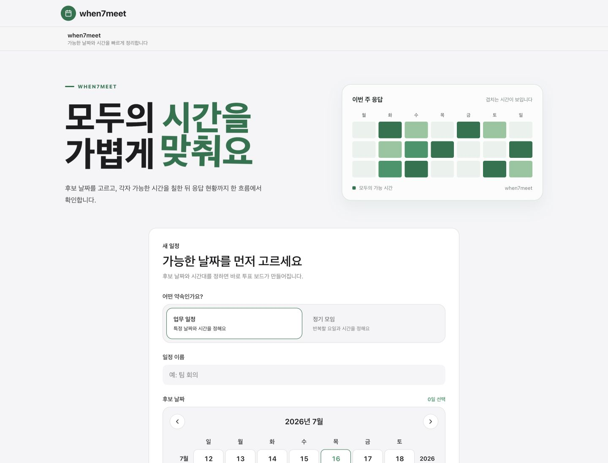
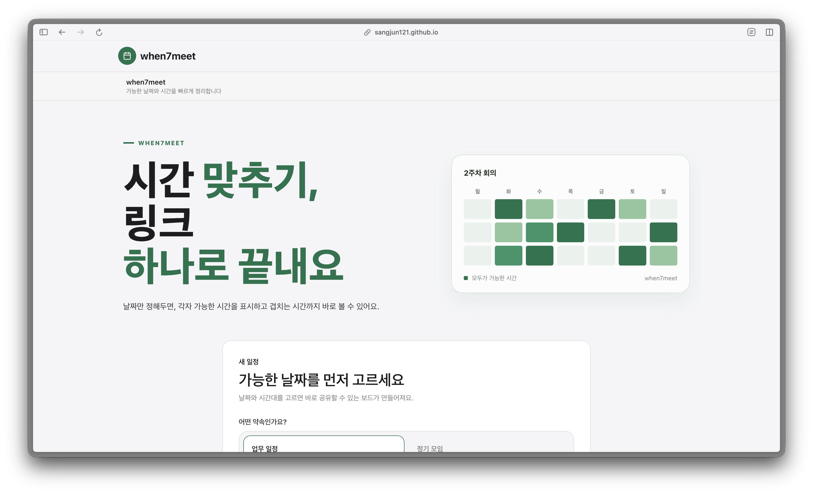
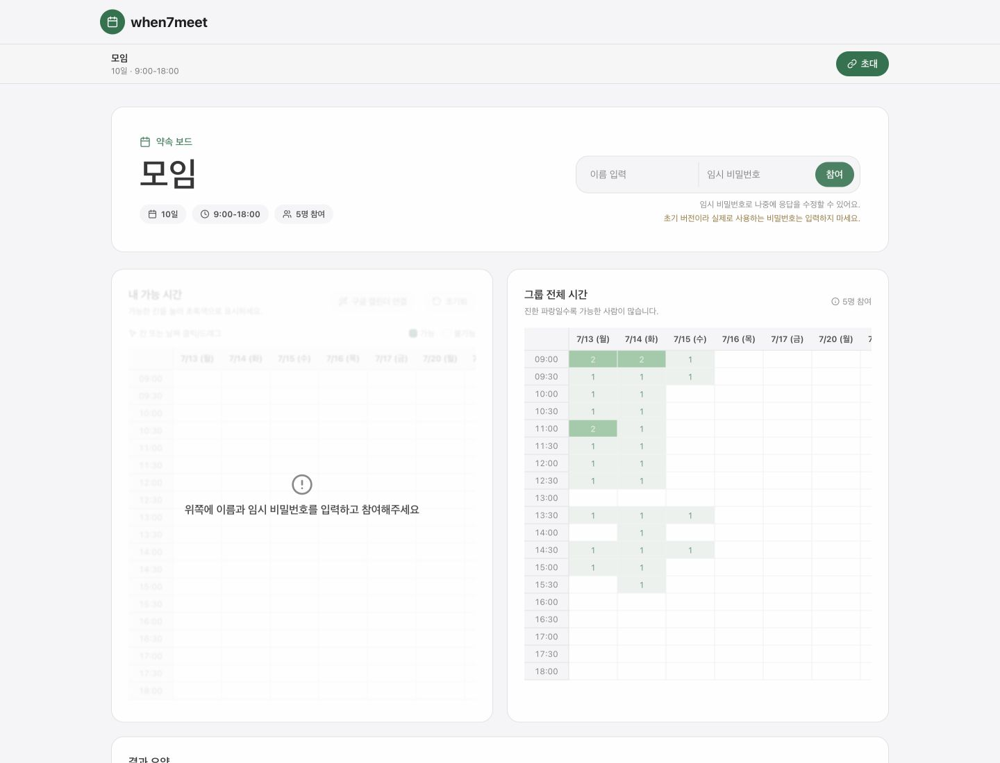
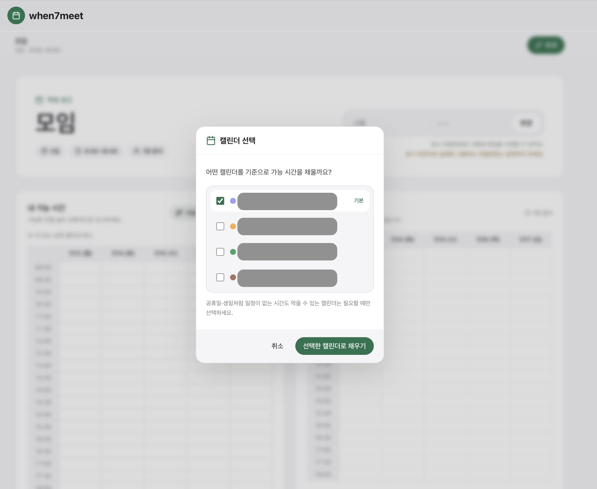
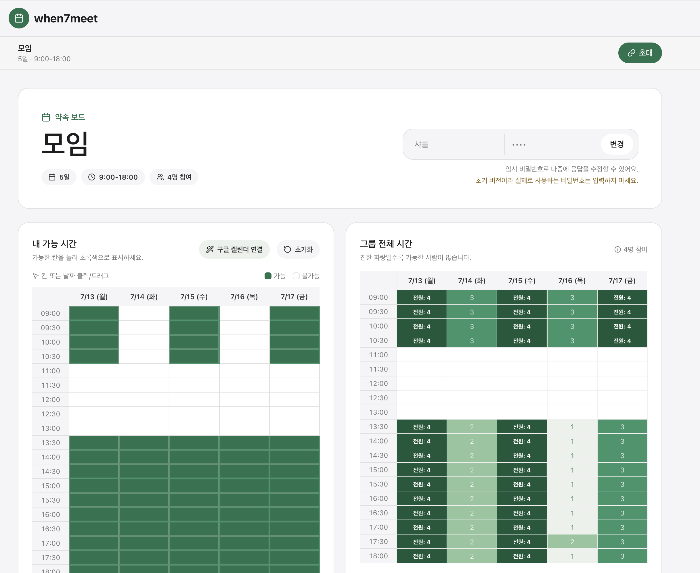

  

<h1 align="center">when7meet</h1>

  모두의 가능한 시간을 가볍게 모으는 일정 조율 서비스

  <a href="https://sangjun121.github.io/when-7-meet/"><strong>서비스 바로가기</strong></a>
  ·
  <a href="https://github.com/sangjun121/when-7-meet/issues">버그 제보</a>
  ·
  <a href="https://github.com/sangjun121/when-7-meet/issues">기능 제안</a>
  ·
  <a href="SECURITY.md">Security</a>

  
  
  
  

## 서비스 소개 영상

  

   

**when7meet은 링크 하나로 가능한 시간을 서로 공유하고, 겹치는 시간을 바로 확인할 수 있습니다.**
- **날짜와 요일**을 기준으로 타임 보드를 만들 수 있습니다.
- 칸을 클릭하거나 드래그해서 가능한 시간을 표시할 수 있습니다.
- 그룹원들이 가능한 시간을 히트맵으로 확인할 수 있습니다.
- **구글 캘린더를 연결해 가능한 시간을 자동으로 채울 수 있습니다.**

## 서비스 사진

## Notes

- 구글 캘린더 연동은 Google OAuth 앱 검수 상태에 따라 현재 테스트 계정만 사용할 수 있습니다.
- 아직 초기 버전입니다. 사용 중 불편한 점은 이슈로 남겨주세요.

## License

when7meet is released under the [MIT License](LICENSE).

## Security

Please read [SECURITY.md](SECURITY.md) before reporting a vulnerability.
