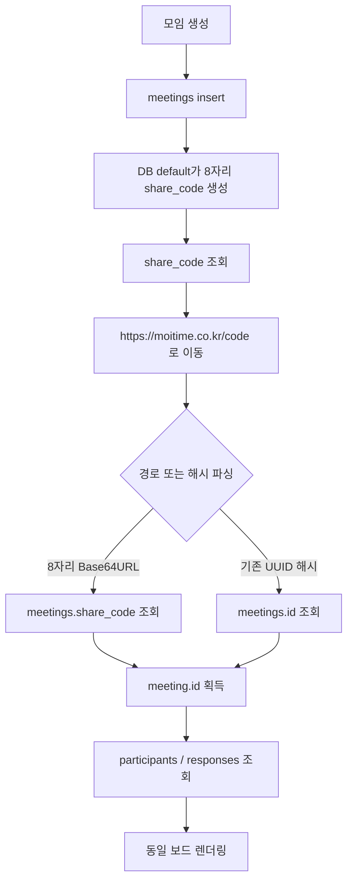

# 공유 링크 단축 트러블슈팅

> 이 문서는 `Moitime`의 UUID 기반 공유 링크를 짧은 경로형 링크로 전환하면서 정리한 설계·구현·검증 기록입니다. 포트폴리오에서는 문제를 발견한 배경, 대안 비교, 데이터 호환성 판단, 배포 장애 대응 순서까지 설명하는 자료로 사용할 수 있습니다.

## 1. 포트폴리오 요약

### 한 문장

기존 UUID 링크를 폐기하지 않고 `share_code`를 별도로 도입해 신규 링크만 짧게 전환했으며, GitHub Pages의 정적 호스팅에서 경로형 링크 새로고침이 깨지지 않도록 `404.html` fallback까지 구성했습니다.

### 구현 결과

```text
기존 링크  https://moitime.co.kr/#board?id=4e3c9573-6b6e-4783-bd1c-4b6339ae0afe
신규 링크  https://moitime.co.kr/aB7_kP2x
```

- 기존 UUID 링크는 계속 `meetings.id`로 조회합니다.
- 신규 모임은 6바이트 난수를 URL-safe Base64로 변환한 8자리 코드를 사용합니다.
- `share_code`에는 unique index를 두어 중복을 데이터베이스에서도 차단합니다.
- GitHub Pages가 `/aB7_kP2x`를 직접 요청받아도 앱을 로드하도록 빌드 결과에 `404.html`을 생성합니다.
- 짧은 코드는 식별자이지 인증 수단이 아니므로 기존 참여자 임시 비밀번호 흐름을 유지합니다.

## 2. 문제 상황

기존에는 Supabase UUID를 그대로 URL 해시에 넣었습니다.

```text
https://moitime.co.kr/#board?id=4e3c9573-6b6e-4783-bd1c-4b6339ae0afe
```

기능상 동작하지만 다음 문제가 있었습니다.

1. 링크가 길어 모바일 채팅방에서 읽기 어렵습니다.
2. 링크의 핵심 정보보다 UUID가 먼저 보여 공유 메시지가 복잡해집니다.
3. 서비스의 공유 경험이 단순한 모임 코드보다 데이터베이스 내부 식별자를 노출하는 형태에 가깝습니다.
4. 이미 전파된 UUID 링크가 있으므로 기존 링크를 새 형식으로 일괄 교체할 수 없습니다.
5. GitHub Pages는 서버 라우팅 설정을 직접 구성할 수 없는 정적 호스팅이므로 `/코드` 경로를 새로고침할 때 404가 발생할 수 있습니다.

## 3. 요구사항과 제약

### 기능 요구사항

- 새 모임 링크는 짧고 복사하기 쉬워야 합니다.
- 모임 코드로 기존 모임을 조회할 수 있어야 합니다.
- 공유 버튼과 투표 완료 공유가 같은 짧은 링크를 사용해야 합니다.
- 모바일 브라우저와 카카오톡 인앱 브라우저에서 경로가 깨지지 않아야 합니다.

### 호환성 요구사항

- 기존 `#board?id=<UUID>` 링크를 삭제하지 않습니다.
- 기존 UUID를 데이터베이스에서 변경하지 않습니다.
- 프론트엔드 배포와 데이터베이스 마이그레이션 사이의 짧은 공백에서도 기존 링크는 읽혀야 합니다.
- 마이그레이션 실패 시 모든 모임이 동시에 접근 불가 상태가 되지 않아야 합니다.

### 보안 요구사항

- URL에 비밀번호, OAuth secret, Supabase service role key를 넣지 않습니다.
- 코드는 인증 토큰이 아니라 모임 식별자로만 사용합니다.
- 순차적인 숫자 ID를 사용해 전체 모임 수나 생성 순서를 노출하지 않습니다.

## 4. 원인 분석

### URL이 길어진 직접 원인

UUID는 128비트 식별자이고 일반적인 문자열 표현은 36자입니다. 기존 라우터는 이 값을 그대로 해시 쿼리에 넣었습니다.

```text
#board?id=<36-character-uuid>
```

UUID를 단순히 앞부분만 잘라 쓰면 URL은 짧아지지만, 서로 다른 모임이 같은 코드가 될 수 있습니다. 해시나 암호화로 줄여도 데이터베이스 조회를 위한 충돌 방지와 매핑이 별도로 필요합니다.

### 경로형 URL의 새로고침 문제

`#board?id=...`에서 `#` 뒤 값은 브라우저가 서버에 요청할 때 전송하지 않습니다. 그래서 GitHub Pages는 항상 `/`의 정적 앱만 전달하고, React가 해시를 읽어 라우팅할 수 있습니다.

반대로 다음 주소는 서버에 실제 경로 요청을 보냅니다.

```text
/aB7_kP2x
```

GitHub Pages에 해당 파일이 없으면 `404.html`을 반환합니다. 따라서 빌드 시 `index.html`을 `404.html`로 복사해 정적 SPA fallback을 만들었습니다. 앱은 `window.location.pathname`의 마지막 경로 세그먼트를 모임 코드로 해석합니다.

## 5. 코드 생성 방식 대안 비교

충돌 확률은 코드 공간을 `N`, 발급 수를 `n`이라고 할 때 생일 문제 근사식으로 비교했습니다.

```text
P(collision) ≈ n(n - 1) / (2N)
```

아래 확률은 코드가 10만 개 발급됐을 때의 근사치입니다. 실제 서비스에서는 unique index가 최종 방어선이므로 확률이 0이 되는 것은 아니지만, 충돌 가능성을 실용적인 수준으로 낮추는 기준으로 사용했습니다.

| 방식 | 길이 | 코드 공간 | 10만 개 발급 시 근사 충돌 확률 | 장점 | 단점 | 판단 |
| --- | ---: | ---: | ---: | --- | --- | --- |
| UUID 원문 | 36자 | `2^128` | 사실상 0 | 이미 존재하고 충돌 걱정이 거의 없음 | URL이 너무 김 | 기존 식별자로 유지 |
| UUID Base64URL 인코딩 | 22자 | `2^128` | 사실상 0 | 매핑 없이 UUID를 표현 가능 | 여전히 길고 내부 ID가 노출됨 | 요구사항에 비해 김 |
| UUID 앞부분 자르기 | 6~10자 | UUID 일부 | 계산 불가, 충돌 취약 | 구현이 매우 쉬움 | 충돌 시 다른 모임을 가리킬 수 있음 | 사용하지 않음 |
| 순차 숫자 ID | 6~8자 | 발급 범위에 의존 | 중복 없음 | 가장 짧고 구현이 쉬움 | 생성량과 순서 노출, 추측 가능 | 사용하지 않음 |
| 6자리 숫자 | 6자 | `10^6` | 거의 100%에 가까움 | 입력이 쉬움 | 현재 규모에서도 충돌 위험이 큼 | 사용하지 않음 |
| 6자리 Base62 | 6자 | `62^6` | 약 8.8% | 영문·숫자만 사용 | 규모가 커지면 충돌 위험, 생성 구현이 복잡해짐 | 사용하지 않음 |
| 10자리 hexadecimal | 10자 | `16^10 = 2^40` | 약 0.455% | 구현이 단순하고 URL 안전 | 코드가 상대적으로 김 | 이전 구현 및 호환용 |
| 8자리 Base62 | 8자 | `62^8` | 약 0.0023% | 영문·숫자만 사용, 충분한 공간 | Base62 변환 로직이 필요 | 가능하지만 과한 구현 |
| **8자리 Base64URL** | **8자** | **`64^8 = 2^48`** | **약 0.0018%** | 짧고 URL 안전하며 PostgreSQL 구현이 간단함 | `_`, `-`가 포함될 수 있음 | **최종 선택** |

### 최종 선택 이유

8자리 Base64URL은 6바이트 난수만 사용하면서 48비트 공간을 확보합니다. 기존 10자리 hexadecimal보다 2글자 짧고, 경우의 수는 `2^40`에서 `2^48`로 늘어납니다.

```sql
translate(
  rtrim(encode(gen_random_bytes(6), 'base64'), E'\n='),
  '+/',
  '-_'
)
```

일반 Base64의 `+`, `/`는 URL 경로에서 해석 문제를 만들 수 있으므로 `-`, `_`로 치환합니다. 6바이트는 Base64 인코딩 결과가 정확히 8글자가 되어 별도의 길이 절단도 필요하지 않습니다.

## 6. 데이터 모델 결정

기존 UUID를 `share_code`로 교체하지 않고 별도 컬럼을 추가했습니다.

```sql
alter table public.meetings
  add column if not exists share_code text;

create unique index if not exists meetings_share_code_key
  on public.meetings (share_code);
```

### 별도 컬럼을 선택한 이유

- 기존 UUID를 참조하는 `participants`, `responses`의 외래키 구조를 건드리지 않습니다.
- 기존 링크의 조회 기준인 `meetings.id`를 보존합니다.
- 신규 링크와 기존 링크를 같은 모임 데이터에 연결할 수 있습니다.
- 필요하면 향후 코드 만료, 코드 재발급, 여러 개의 별칭 링크를 확장할 수 있습니다.
- unique index를 통해 애플리케이션 검증을 통과한 값도 데이터베이스가 최종적으로 중복 방지합니다.

### 코드의 역할과 한계

`share_code`는 다음 기능만 담당합니다.

```text
짧은 URL 경로 -> 모임 row 식별 -> 기존 UUID로 참여자/응답 조회
```

코드를 아는 사람이 모임을 조회할 수 있는 현재 서비스 권한 모델은 그대로입니다. 따라서 짧은 코드를 비밀번호, 권한 토큰, 개인정보 보호 장치로 설명하면 안 됩니다.

## 7. 구현 흐름



### 프론트엔드 라우팅

`src/App.jsx`에서 다음 형식을 처리합니다.

```text
/<8-character-share-code>
#board?id=<existing-uuid>
```

경로형 URL은 `parseBoardPath`가 마지막 세그먼트를 검사하고, 기존 URL은 `parseBoardHash`가 UUID를 읽습니다. 코드 패턴은 신규 8자리 Base64URL과 이전에 생성됐을 수 있는 10자리 hexadecimal을 모두 허용합니다.

### 데이터 접근 계층

`src/lib/boardApi.js`는 조회 기준만 분리합니다.

```text
loadMeeting(uuid)          -> meetings.id 조회
loadMeetingByShareCode(code) -> meetings.share_code 조회
```

두 함수는 이후 참여자와 응답을 동일한 `meeting.id`로 조회하므로 보드 데이터 조립 로직이 중복되지 않습니다.

### 마이그레이션 전 fallback

프론트엔드가 먼저 배포되고 데이터베이스 마이그레이션이 늦어질 수 있습니다. 이 순서에서 기존 링크까지 깨지지 않도록 다음 fallback을 넣었습니다.

1. UUID 조회에서 `share_code` 컬럼 누락 오류가 발생하면 기존 컬럼만 선택해 다시 조회합니다.
2. 마이그레이션 전 모임 생성에서는 코드 조회 실패 시 UUID 링크로 이동합니다.
3. 짧은 경로 조회는 컬럼이 없으면 마이그레이션 안내 오류를 표시합니다.

이 fallback은 마이그레이션 누락을 영구히 숨기기 위한 것이 아니라, 배포 순서가 어긋난 짧은 시간 동안 기존 사용자를 보호하기 위한 장치입니다.

## 8. GitHub Pages 경로 fallback

Vite 설정의 `copyGithubPagesFallback` 플러그인이 빌드 완료 시 아래 파일을 만듭니다.

```text
dist/index.html -> dist/404.html
```

GitHub Pages는 `/aB7_kP2x` 파일이 없을 때 `404.html`을 반환하지만, 브라우저에서는 동일한 React 앱이 실행됩니다. 앱이 pathname에서 코드를 읽으므로 URL을 `#` 방식으로 바꾸지 않고도 보드를 열 수 있습니다.

이 처리가 없으면 다음 현상이 발생합니다.

1. 링크를 클릭해 최초 진입할 때는 개발 서버나 일부 캐시 상황에서 동작합니다.
2. 사용자가 새로고침하면 GitHub Pages가 `/aB7_kP2x` 파일을 찾습니다.
3. 파일이 없어 404 화면이 표시됩니다.

따라서 `404.html`은 장식 파일이 아니라 경로형 링크의 핵심 배포 산출물입니다.

## 9. 마이그레이션과 배포 순서

### 데이터베이스

Supabase SQL Editor에서 [`supabase/migrations/20260718000000_add_meeting_share_code.sql`](../supabase/migrations/20260718000000_add_meeting_share_code.sql)을 한 번 실행합니다.

마이그레이션은 다음 순서로 동작합니다.

1. `share_code` 컬럼을 없을 때만 추가합니다.
2. 코드 생성 함수를 교체합니다.
3. 기존 `share_code is null` 모임에 8자리 코드를 채웁니다.
4. unique index를 생성합니다.
5. 신규 insert의 default를 생성 함수로 지정합니다.
6. 모든 기존 row가 채워진 뒤 `not null`을 설정합니다.

### 애플리케이션

1. Supabase 마이그레이션 성공 여부를 확인합니다.
2. 프론트엔드를 빌드합니다.
3. `dist/index.html`과 `dist/404.html`이 함께 배포됐는지 확인합니다.
4. 새 모임을 만들어 `/8자리코드`가 발급되는지 확인합니다.
5. 기존 UUID 링크와 새 경로 링크를 각각 새로고침합니다.
6. 이름·임시 비밀번호 입력과 가능 시간 저장이 두 링크에서 동일하게 동작하는지 확인합니다.

### 롤백

프론트엔드만 되돌리면 기존 `#board?id=<UUID>` 라우트는 계속 사용할 수 있습니다. `share_code` 컬럼은 즉시 삭제하지 않습니다. 새 경로 링크가 이미 전달된 뒤 컬럼을 삭제하면 짧은 링크가 모두 끊기므로, 데이터 사용이 끝난 후 별도 마이그레이션으로 제거해야 합니다.

## 10. 장애 시나리오와 대응

| 증상 | 원인 | 확인 방법 | 대응 |
| --- | --- | --- | --- |
| 기존 UUID 링크가 갑자기 실패 | 새 컬럼을 포함한 select가 구 스키마에서 실패 | Supabase 응답 코드 `PGRST204` 또는 `42703` 확인 | UUID 조회 fallback으로 기존 컬럼만 재조회 |
| 새 `/코드` 링크가 모임을 찾지 못함 | `share_code` 마이그레이션 미실행 또는 코드 오탈자 | SQL Editor에서 컬럼·값 조회 | 마이그레이션 실행 후 실제 생성 코드로 재검증 |
| 새로고침에서 404 | `dist/404.html`이 배포되지 않음 | Actions artifact 내부 파일 목록 확인 | Vite build 결과에 `404.html` 포함 여부 확인 |
| 새 모임이 UUID 링크로 열림 | 생성 직후 `share_code` 조회 실패 또는 schema cache 지연 | 생성 응답과 Supabase 컬럼 조회 확인 | 배포 순서 확인; 모임 자체는 UUID로 보존됨 |
| 코드 중복 insert 오류 | 극히 낮은 확률의 랜덤 충돌 또는 동시 생성 경쟁 | DB unique violation 로그 확인 | unique index 유지; 규모가 커지면 insert 재시도 정책 추가 |
| 특정 보드만 새 코드로 안 열림 | 기존 코드 형식과 라우터 정규식 불일치 | 해당 코드 길이·문자셋 확인 | 구형 10자리 hex와 신규 8자리 Base64URL을 모두 허용 |
| 카카오톡 미리보기에서 모임별 제목이 안 바뀜 | 카카오 크롤러 요청에 브라우저 hash가 포함되지 않음 | OG 요청 로그와 실제 HTML 비교 | 공통 OG는 유지하고, 동적 미리보기는 SSR/메타 엔드포인트로 별도 설계 |

## 11. 검증 기록

### 현재 코드에서 수행한 검증

- `npm run build` 통과
- `dist/404.html` 생성 확인
- `dist/index.html`과 `dist/404.html`의 내용 일치 확인
- `git diff --check` 통과
- 변경 파일에서 service role key, OAuth client secret, private key 패턴 미검출
- 로컬 Vite 서버에서 앱 HTML 응답 확인

### Supabase 적용 후 반드시 수행할 검증

```text
[ ] meetings.share_code 컬럼이 존재한다.
[ ] 기존 meetings row마다 share_code가 채워져 있다.
[ ] meetings_share_code_key unique index가 존재한다.
[ ] 신규 meeting insert 시 8자리 코드가 자동 생성된다.
[ ] 기존 UUID 링크가 열린다.
[ ] 신규 /코드 링크가 열린다.
[ ] 두 링크에서 같은 participants와 responses가 보인다.
[ ] /코드 상태에서 새로고침해도 보드가 유지된다.
[ ] 모바일 카카오톡 인앱 브라우저에서도 경로가 유지된다.
```

## 12. 포트폴리오용 정리

### 문제 → 원인 → 결정 → 결과

**문제**: Supabase UUID를 포함한 공유 링크가 길고 사용자에게 복잡하게 보였다. 그러나 이미 전달된 UUID 링크를 폐기할 수 없었다.

**원인**: 데이터베이스의 내부 식별자와 사용자가 공유하는 링크 식별자를 같은 값으로 사용하고 있었다. 또한 GitHub Pages는 서버 라우팅이 없는 정적 호스팅이라 경로형 URL 새로고침 시 404가 발생할 수 있었다.

**결정**: UUID는 외래키와 기존 라우팅을 위해 유지하고, `share_code`를 별도 컬럼으로 추가했다. 여러 후보 중 URL-safe 문자와 구현 복잡도를 비교해 48비트 공간의 8자리 Base64URL을 선택했다. unique index를 최종 방어선으로 두고 GitHub Pages에는 `404.html` fallback을 추가했다.

**결과**: 신규 링크 길이를 36자리 UUID 기반 구조에서 8자리 코드 기반 구조로 줄이면서, 기존 링크와 데이터 구조를 유지할 수 있게 됐다. 정적 호스팅에서도 경로형 링크 새로고침을 처리할 수 있는 배포 구조를 확보했다.

### 이력서 bullet 후보

- 기존 UUID 공유 링크를 폐기하지 않고 `share_code` 매핑 컬럼과 이중 조회 라우팅을 도입해 신규 링크만 8자리 경로형 URL로 전환했습니다.
- 6바이트 난수를 URL-safe Base64로 인코딩해 48비트 공간을 확보하고, DB unique index를 최종 방어선으로 두어 짧은 링크의 충돌 가능성을 관리했습니다.
- GitHub Pages의 정적 라우팅 한계로 발생하는 경로형 URL 새로고침 404를 Vite 빌드 단계의 `404.html` fallback으로 해결했습니다.
- 프론트엔드와 DB 마이그레이션 순서가 어긋나도 기존 UUID 사용자가 영향을 받지 않도록 schema-missing fallback과 UUID 링크 보존 전략을 적용했습니다.

### 면접 답변 예시

> 기존에는 Supabase UUID를 그대로 공유해서 URL이 길었습니다. 하지만 이미 배포된 링크를 끊을 수 없었기 때문에 UUID를 바꾸는 대신 `share_code`를 별도 컬럼으로 추가하고, 신규 링크만 짧은 경로로 만들었습니다. 6바이트 난수를 URL-safe Base64로 변환하면 8글자에 48비트 공간을 사용할 수 있어 10자리 hex보다 짧고 충돌 공간은 더 큽니다. 데이터베이스 unique index를 최종 방어선으로 두었고, GitHub Pages는 경로 새로고침을 서버에서 처리할 수 없어서 빌드 결과에 `404.html`을 함께 생성했습니다. 기존 UUID 조회 fallback도 넣어 마이그레이션 전후의 링크 단절을 막았습니다.

### 면접에서 과장하지 않을 부분

- 실제 Supabase 마이그레이션을 운영 프로젝트에 적용한 시점과 결과를 확인하기 전에는 "무중단 배포를 달성했다"고 표현하지 않습니다.
- 실제 트래픽 수치가 없으므로 "대규모 트래픽을 처리했다"고 표현하지 않습니다.
- 충돌은 unique index가 방지하지만, 동시 충돌 시 자동 재시도까지 필요하면 별도 구현과 테스트가 필요합니다.
- `share_code`는 인증이나 접근 제어가 아니므로 보안 토큰이라고 설명하지 않습니다.

## 13. 관련 파일

- [`src/App.jsx`](../src/App.jsx): 경로형·UUID 라우팅, 공유 URL 생성, GitHub Pages 경로 fallback 전제
- [`src/lib/boardApi.js`](../src/lib/boardApi.js): UUID 및 `share_code` 조회와 구 스키마 fallback
- [`supabase/schema.sql`](../supabase/schema.sql): 신규 설치용 컬럼·생성 함수·unique index
- [`supabase/migrations/20260718000000_add_meeting_share_code.sql`](../supabase/migrations/20260718000000_add_meeting_share_code.sql): 기존 DB 적용용 멱등성 마이그레이션
- [`vite.config.js`](../vite.config.js): `dist/404.html` 생성 플러그인
